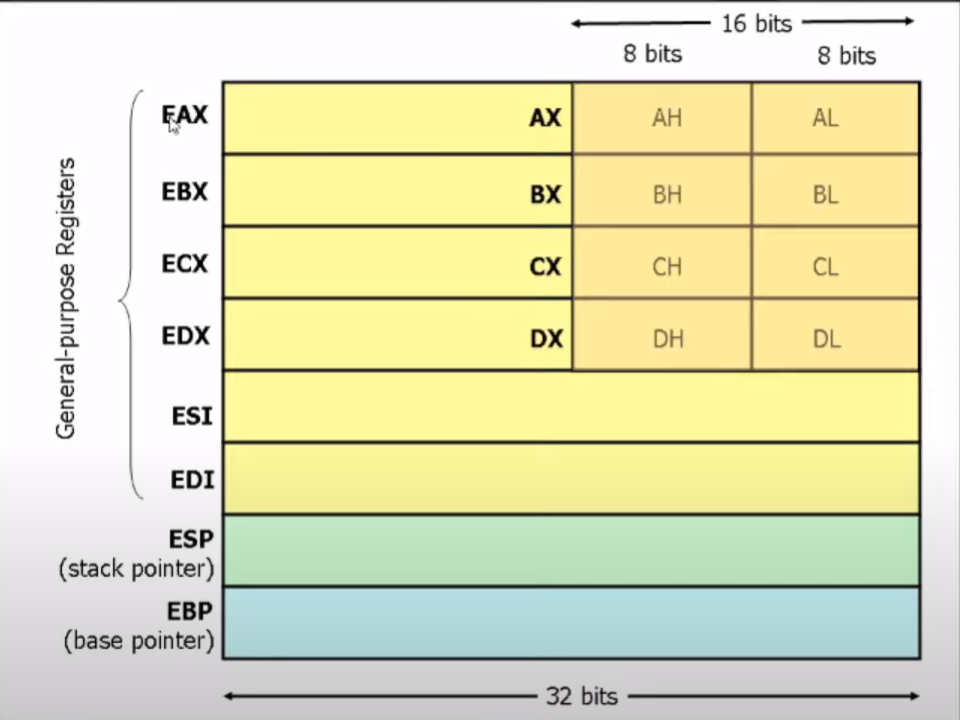
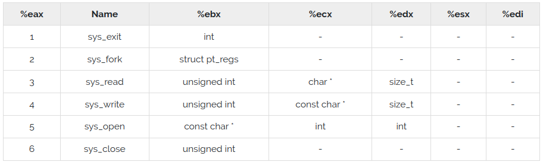

# [x86 NASM Assembly Crash Course](https://www.youtube.com/watch?v=DNPjBvZxE3E)

## Three `section`s

### `section .data`

Define constants: strings, magic numbers (codes), terminating strings, etc.

### `section .bss`

Block Starting Symbol: reserve space in memory for future data.

### `section .text`

The program's instructions.

Required label:

- `_start`: for linking with `ld`.
- `main`: for linking with `gcc`.

## Registers

Hardware-implemented variables.

### 32 Bit

<p align="center">
  
</p>

#### General Purpose Registers

Can be used for anything even though they have an intended use.

- `eax`: Accumulator register, where the result of arithmetic operations is stored.
  Can also store the syscall instruction (see `unistd_32.h`).
- `ecx`: Counter, for incrementing, decrementing and controlling loops.
- `esi` and `edi`: Source and Destination Indexes, for copying large pieces of data.

#### Data Stack Registers

- `esp`: Stack Pointer, points to the top of the data stack.
- `ebp`: Base Pointer, points to the bottom of the data stack.

#### Flags Register

Each bit means something.

- `CF`: Carry Flag, is the result of the last operation in a carry-over?
- `OF`: Overflow Flag
- `ZF`: Zero Flag, is the result of the last operation end in a zero?
- `SF`: Sign Flag, is the result of the last operation negative?
- `PF`: Parity Flag, is the result of the last operation even?

### 64 Bit

Can also use 32-bit registers.

- `rax`: 64-bit `eax` (see `unistd_64.h`).

## Instructions

### Move

```nasm
; Copy data from src to dest.
mov dest, src

; Zero-Extended Move: zero out dest and copy data from src to dest.
movzx dest, src
; Zero out eax and copy the first byte of the address pointed at by ebx to it.
movzx eax, byte ptr [ebx]

; Sign-Extended Move:
; if src is negative then dest is filled with 1s before the copy.
; if src is positive then dest is filled with 0s before the copy.
movsx dest, src
```

### Bitwise

```nasm
; And (&): operate bx and ax bits and store result in ax.
and ax, bx

; Or (|): operate bx and ax bits and store result in ax.
or ax, bx

; Exclusive Or (^): operate bx and ax bits and store result in ax.
xor ax, bx

; Check whether src and dest are equal and store result in the flag register.
test ax, bx
```

### Arithmetic

```nasm
; Add ax with bx and store result in ax.
add ax, bx

; Subtract ax with bx and store result in ax.
sub ax, bx

; Multiply ax and bx and store in dx:ax.
mul bx

; Divide dx:ax by bx and store in ax and Rdx (the remainder).
div bx
```

### Jump

```nasm
; Jump to label.
jmp label

; If Zero Flag equals 1 jump to label.
je label
; If Zero Flag equals 0 jump to label.
jne label

; Jump Zero.
jz label

; Jump Carry.
jc label

; Jump Overflow.
jo label

; Jump Sign Flag.
js label

; Jump Greater.
jg label
; Jump Greater Than Or Equal To.
jge label

; Jump Less.
jl label
; Jump Less Than Or Equal To.
jle label

; Jump Above.
ja label
; Jump Above Equal.
jae label

; Jump Below.
jb label
; Jump Below Equal.
jbe label
```

### Call and Return

```nasm
; Like jump but saves current location of the code.
; Used when executing external functions.
call label
; The same as:
; Push the address of the current instruction to the call stack.
push rip
; Then jump to label.
jmp label

; Return to the next instruction after the last call.
ret
; The same as:
; Pop the address of the next instruction after the last call from the call stack.
pop rip
```

### Comparisons

```nasm
; Compare: subtract x1 with x2 and updates the Zero and Carry flags with the result.
; Doesn't save the result anywhere.
cmp x1, x2
```

### Bit Shifting and Rotating

```nasm
10011001 -> Shift Right -> 01001100
10011001 -> Shift Left  -> 00110010

10011001 -> Arithmetic Shift Right -> 10001100
10011001 -> Arithmetic Shift Left  -> 10110010

10011001 -> Rotate Right -> 11001100
10011001 -> Rotate Left  -> 00110011
```

```nasm
; Shift Right: shift all bits of ax to the right once.
shr ax, 1
; Shift Left: shift all bits of ax to the left once.
shl ax, 1

; Arithmetic Shift Right: shift all bits of ax to the right once
; while preserving the sign of the number (the most significant bit).
sar ax, 1
; Arithmetic Shift Left: shift all bits of ax to the left once
; while preserving the sign of the number (the most significant bit).
sal ax, 1

; Rotate Right: rotate all bits of ax to the left once.
ror ax, 1
; Rotate Left: rotate all bits of ax to the left once.
rol ax, 1
```

### Masks

```nasm
Bytes      Mask       Extracted Bits
10011001 & 00110000 = 00010000
```

```nasm
; eax: 01010101010101010101010101010101
and eax, 0xFFFF0000
; eax: 01010101010101010000000000000000
shr eax, 16
; eax: 00000000000000000101010101010101
```

### System Calls

Temporarily delegate control of the program to the kernel
to perform various functions (I/O, storage, networking etc.)

Find system calls in `unistd.h`:

```nasm
$ fd unistd.h /
```

We set `eax` with the system call we want to execute,
then we pass the parameters to their respective registers and call `int 0x80`:

<p align="center">
  
</p>

```nasm
; Execute the sys_exit call:
mov eax, 1
int 0x80

; Execute the sys_read call:
mov eax, 3
mov ebx, 0
mov ecx, buffer
mov edx, bytes_to_read
int 0x80

; Execute the sys_write call:
mov eax, 4
mov ebx, 1
mov ecx, message
mov edx, message_length
int 0x80
```

### Linking 32-bit Objects

Install `gcc` multilib packages to link 32-bit objects in 64-bit system:

```bash
$ sudo apt-get install gcc-multilib g++-multilib
$ nasm -f elf32 printf1.asm && gcc -m32 -no-pie printf1.o &&./a.out
```

### `nasm -l routine.lst`

Create a list file with a breakdown of each instruction and its binary equivalent:

```bash
$ nasm -f elf64 -l printf.lst printf.asm
```

## Resources

### University of Maryland, Baltimore County

- https://www2.umbc.edu/ieee/resources.html
- https://asmtutor.com/
- https://cs.lmu.edu/~ray/notes/nasmtutorial/

### Linking 32-bit Objects

- https://stackoverflow.com/a/31773356

### TutorialsPoint

- https://www.tutorialspoint.com/assembly_programming/assembly_system_calls.htm

### `printf`

- https://stackoverflow.com/questions/8194141/how-to-print-a-number-in-assembly-nasm
- https://gist.github.com/jamichaels/a5e770105615d9e32b18
- https://github.com/blefev/assembly-printf
- https://stackoverflow.com/questions/40458869/calling-printf-from-assembly-language-on-64bit-and-32bit-architecture-using-nasm
- https://www.csee.umbc.edu/portal/help/nasm/sample_64.shtml
- https://www.csee.umbc.edu/portal/help/nasm/sample.shtml

### Calling Conventions

- https://en.wikipedia.org/wiki/Calling_convention
- https://en.wikipedia.org/wiki/X86_calling_conventions#cdecl
- https://libra.cs.virginia.edu/~aaron/08-nasm/nasmexamples.html

### `mov` vs. `lea` and `default rel`

- https://stackoverflow.com/questions/31234395/why-use-rip-relative-addressing-in-nasm

### `movsx`

- https://courses.ics.hawaii.edu/ReviewICS312/morea/DataSizeAndArithmetic/ics312_datasize.pdf
- https://www.felixcloutier.com/x86/movsx:movsxd
- https://stackoverflow.com/questions/47350568/yasm-movsx-movsxd-invalid-size-for-operand-2

### Parity

- https://en.wikipedia.org/wiki/Parity_bit

### Markdown

- https://github.com/github/linguist/blob/master/lib/linguist/languages.yml
- https://github.com/github/linguist
- https://docs.github.com/en/get-started/writing-on-github/working-with-advanced-formatting/creating-and-highlighting-code-blocks
- https://docs.github.com/en/get-started/writing-on-github/getting-started-with-writing-and-formatting-on-github/basic-writing-and-formatting-syntax
